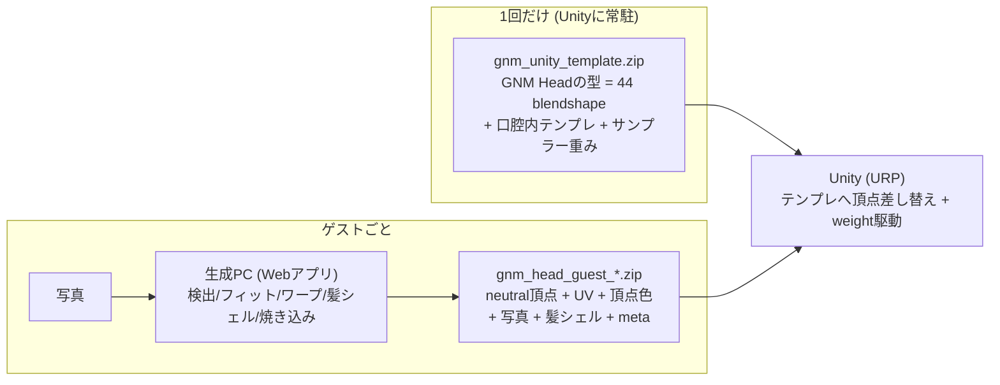

# Unity統合指示書 — GNM Head 再生ランタイム (URP)

生成PC (このリポジトリのWebアプリ) からデータを受け取り、Unity (URP) で
写真由来の頭部を表示・表情アニメーションさせるための仕様書。

役割分担: **推論・フィット・焼き込みはすべて生成PC側で完了済み**。
Unityは「テンプレートメッシュにゲストデータを差し込み、blendshapeウェイトを毎フレーム動かす再生専用機」。



この分離が成立する理由 (設計の核):

- ランタイムの頂点式は `final = sim( neutralU + Σ cᵢ·exprScalesᵢ·basisΔᵢ )`。
  `sim` (フィットの相似変換 = 等方スケール+Z回転+平行移動) は**線形**なので、
  Transformとして外に出せる
- よって **blendshape (basisΔ) は全ゲスト共通** = テンプレートとしてUnity常駐でよい。
  ゲスト固有なのは neutral頂点・UV・頂点色・テクスチャ・髪シェル・sim・exprScales だけ

## 1. 入力ファイル

### 全ゲスト共通: `gnm_unity_template.zip` (WebアプリのExport Templateボタン。1回だけ)

| ファイル | 内容 |
|:--|:--|
| `template.glb` | `HeadTemplate` (平均形状 + morph 44 POSITION + **glTF skin**) / `MouthInteriorTemplate` (morph 44 POSITION+NORMAL + skin)。骨格は `neck`(根)→`head`→`left_eye`/`right_eye` の4ボーン |
| `template_meta.json` | blendshape名・目領域フラグ・blinkベクトル・舌姿勢・口腔内vertexMap/partId/色式 (§3) |
| `gnm_expression_decoder.bin` | 表情サンプラー (CVAEデコーダ) の重み 0.76MB (§5) |

skinは公式GNMの `linear_blend_skinning` そのもの (skinning_weightsは公式npz由来・頂点あたり4関節)。
これにより首の回転 (肩を残して頭だけ回る) と視線 (眼球回転) がUnityネイティブのボーンで動く。

テンプレートはGNMアセットを変えたときだけ再エクスポートする (通常は据え置き)。

### ゲストごと: `gnm_head_guest_<YYYYMMDDhhmmss>.zip` (Export Guestボタン)

| ファイル | 内容 |
|:--|:--|
| `guest.glb` | 下記構造。メッシュはmorphを持たない (型はテンプレート側にある) |
| `meta.json` | exprScales・口腔内基準色・ビュー制約など (§3) |

```text
HeadRoot (node)             ← yaw/pitch回転はこのnodeに掛ける (実重心pivot済み)
├─ Head      : 未変換空間のneutral頂点 + UV + COLOR_0(VEC4) + 写真テクスチャ。
│              nodeのTransform = フィット相似変換 (回転pivot合成済み)。**この値をテンプレ側でも使う**
└─ HairShell : 髪シェル (最終空間の静的メッシュ)。写真RGB×髪マスクalpha合成済みRGBAテクスチャ
```

- 正本 (フォーマットを変えたら必ずここが変わる): `src/unityExport.ts`
- 単位: faceWidth≈1 のモデル空間。実寸ではない
- 座標変換 (glTF右手系→Unity左手系) はglTFastが吸収する。テンプレとゲストを
  **同じローダー (glTFast) で読む**こと — 頂点順・座標変換が揃うことが前提

## 2. Unity側のロードフロー

1. **起動時**: `template.glb` をglTFastでロードし、`HeadTemplate` / `MouthInteriorTemplate` の
   Mesh (blendshape 44個 + boneWeights付き) とボーンTransform群を取得。
   `Mesh` は `Instantiate` して書き換え用の複製を作る
2. **ゲスト到着**: `guest.glb` をロードし、`Head` ノードから
   `vertices / uv / colors` と `localPosition / localRotation / localScale` を取り出す
3. **頭部**: テンプレ複製Meshへ `vertices / uv / colors` を代入 (`RecalculateBounds`)。
   SkinnedMeshRendererに割り当て、ルートGameObjectのTransformへ `Head` ノードの値をコピー
4. **ボーン再配置**: guest metaの `joints.bindPositions` (未変換空間 = メッシュのローカル空間)
   に合わせてボーンを動かし、bindposesを計算し直す:
   ```csharp
   // bones[j] はテンプレ由来のボーンTransform (Headオブジェクトの子階層)。
   // bindPositions はメッシュローカル空間の絶対位置なので、親からの相対に直して代入する
   bones[j].localPosition = bindPos[j] - bindPos[parent[j]];  // 根はそのまま
   bones[j].localRotation = Quaternion.identity;
   // Unity公式レシピ: bindpose = ボーンのworld逆行列 × メッシュルートのworld行列
   bindposes[j] = bones[j].worldToLocalMatrix * meshRoot.localToWorldMatrix;
   mesh.bindposes = bindposes;
   ```
5. **口腔内**: template_metaの `vertexMap` でHeadの頂点配列からスライスして
   `MouthInteriorTemplate` 複製の `vertices` へ代入。`RecalculateNormals` を1回。
   頂点色 = §3の色式で `partId` ごとに計算して代入。ボーン・Transformは頭部と共有
6. **髪**: `HairShell` はguest.glbのインスタンスをそのまま表示 (morphなし・静的)。
   表示位置を決めたら **`head` ボーンの子にする** (`SetParent(headBone, worldPositionStays: true)`) —
   頭をボーンで回したとき髪が付いてくるように (髪シェルは頭皮領域=headウェイト1.0の上に乗るため剛体追従で正しい)
7. **破棄**: 次のゲストが来たら複製Mesh/テクスチャをDestroyして差し替え

検証assert (初回実装時に必ず):
- guest `Head` の頂点数 == テンプレ `HeadTemplate` の頂点数
- skinのボーンが4個 (`neck`/`head`/`left_eye`/`right_eye`)
- 違ったらテンプレとゲストの世代 (metaの `formatVersion`) がズレている

## 3. meta.json スキーマ

正本: `src/unityExport.ts` の `buildTemplateMeta` / `buildGuestMeta`。主要フィールド:

### template_meta.json (ゲスト非依存)

| パス | 意味 |
|:--|:--|
| `expression.names[44]` | blendshapeの名前と並び (weight配列のindexはこの順。GLBのtargetNamesと同一) |
| `expression.eyeFlags[44]` | 1=目領域成分。まばたきはこの成分を**置き換える** (§4) |
| `expression.blinkVector[44]` | 閉眼ベクトル (公式wink_left+wink_right合成の目領域のみ) |
| `expression.followRate` | 目標への毎フレーム追従率 0.06 (**60fps基準**。§4のdt補正参照) |
| `expression.autoCycle` | AUTO巡回のタイミング (感情保持→ニュートラル→次の感情) |
| `tongue.pose` / `coeffLimit` | 舌の常時姿勢ベクトルと係数クランプ (§4) |
| `blink.*` | まばたき周期 (3〜5s)・持続 (150〜250ms)・sin(πt)エンベロープ |
| `mouthInterior.vertexMap[]` | 口腔内ローカル頂点index → 頭部頂点index |
| `mouthInterior.partId[]` | 頂点ごとのパーツID (0=肌 1=口腔壁 2=歯 3=歯茎 4=舌) |
| `mouthInterior.colorModifiers` | 頂点色式の係数: **sRGB空間**で `clamp01(基準色·scale + offset)` |

口腔内の頂点色: 基準色 = guest metaの `colors.skinLinear` (無ければ `lipFallbackLinear`)。
**linear→sRGBへ変換してから**式を適用し、結果をlinearへ戻して頂点色にする (公式GNMの色式がsRGB値で定義されているため)。

### meta.json (ゲスト固有)

| パス | 意味 |
|:--|:--|
| `expression.exprScales[44]` | 残差ワープ由来の成分別振幅補正。**weightに乗算する** (§4) |
| `expression.intensity` | 表情係数への乗数 (既定1) |
| `tongue.poseAmount` | 舌姿勢の振幅 (既定1) |
| `colors.skinLinear` / `lipFallbackLinear` | 口腔内色の基準色 (linear空間) |
| `view.*` | maxYawDeg=15 / maxPitchDeg=12 / fov=30 / cameraDistance=3.4 / 背景色 |
| `image.*` | 元写真サイズ (参考) |

## 4. ランタイム: 毎フレームのweight計算

Web版 (`src/main.ts` の `animate` + `src/gnmHeadMesh.ts` の `applyExpressionNow`) の移植。
式は以下がすべて:

```text
// 1. 目標表情 target[44] を決める (§5のサンプラー出力 × intensity。AUTO巡回は下記)
// 2. 指数追従 (Webは60fps基準の0.06。フレームレート非依存にするならdt補正):
follow = 1 - pow(1 - followRate, deltaTime * 60)
current[i] += (target[i] - current[i]) * follow

// 3. まばたき量 blink (0-1) を合成。目領域は「置き換え」、それ以外は加算:
w[i] = eyeFlags[i] == 1
     ? current[i] * (1 - blink) + blinkVector[i] * blink
     : current[i] + blinkVector[i] * blink

// 4. 舌の常時姿勢 (開口時に舌が口蓋に張り付いて見えないように):
w[tongueComp] += tongue.poseAmount * tongue.pose[name]
w[tongueComp] = clamp(w[tongueComp], -coeffLimit, +coeffLimit)

// 5. ゲスト固有の振幅補正 (残差ワープで瞼開口幅が変わった分):
w[i] *= exprScales[i]

// 6. 適用 (Head と MouthInterior の両方に同じ値)。
//    スケールは決め打ちしない — blendshapeのフレーム登録重みはインポータ依存で、
//    glTFastは frameWeight=1.0 で登録する (×100すると100倍のモーフが掛かる。実障害あり)。
//    メッシュから実際の登録重みを読んで掛けるのが正:
frameWeight = mesh.GetBlendShapeFrameWeight(0, 0)   // glTFast=1.0 / FBXインポータ=100
smr.SetBlendShapeWeight(i, w[i] * frameWeight)
```

- **まばたき**: `blink.periodMin~MaxSec` ごとに発火、持続 `durationMin~MaxMs`、
  エンベロープは `sin(π·t)` (0→1→0)。正本 `src/blink.ts` (43行)
- **AUTO巡回**: 感情を `holdMinMs + rand·holdRandMs` 保持 → ニュートラルを
  `neutralMinMs + rand·neutralRandMs` → 次のクラスへ (直前と同じクラスは避ける。
  潜在zも引き直す)。正本 `src/main.ts` の `animate`
- weightは負値・1超もある (z-scoreスケール)。UnityのSetBlendShapeWeightは範囲外を受け付ける

## 5. 表情サンプラー (C#移植が必要な唯一の頭脳部分)

公式GNMのExpressionSampler = 小さなMLP (CVAEデコーダ、重み0.76MB float16)。
**正本: `src/gnmSampler.ts` (188行)。これをC#へ素直に移植する。** 要点:

- 入力: `concat(latent[64], one-hot label[20])` → 全結合層×N (ReLU/linear) → 出力383成分
- binフォーマット: magic `GNMS` / u32 headerLen / JSONヘッダ
  (`latentDim, numClasses, classNames, outputNames, layers[{in,out,activation,kernel{offset,byteLength},bias{...}}]`) / float16ペイロード
- `sample(class, latent)`: one-hot + 潜在z (標準正規, Box-Muller) をデコード
- `randomize()`: 2〜3クラスを選び、潜在・one-hotを重み付き平均して**1回だけ**デコード
  (出力ベクトルの線形合成で代用してはいけない — ReLU非線形で別物になる)
- 出力383成分 → blendshape 44成分への射影: binヘッダの `outputNames` と
  template_metaの `expression.names` の**名前一致**で対応づける (`toModelCoeffs` 相当)

float16展開はC#では `(float)BitConverter.UInt16BitsToHalf(h)` で済む。

## 6. マテリアル (URP Lit系)

3つとも法線・ライティングの扱いが違う。Web版の再現に必須の式だけ書く。

### Head — Lit系カスタムシェーダ (写真×頂点色mix)

URP標準のLitは頂点色を読まないため、Lit相当のカスタムシェーダを1枚作る
(Shader Graphでも手書きHLSL+UniversalFragmentPBRでもよい。式が下記どおりなら等価):

```text
BaseColor = lerp( VertexColor.rgb, SampleTexture2D(_BaseMap, uv).rgb, VertexColor.a )
Metallic = 0 / Smoothness ≈ 0.05
```

- `COLOR_0.rgb` = fallback色 (シルエット外・背面用。**linear空間の値**)、`COLOR_0.a` = photoW
- 法線は**+Z固定で焼き込み済み** (Web版の「立体感は写真の陰影と視差で出す」方針)。
  ノーマルマップを足さないこと。ライトを強くすると二重陰影になるので、
  Web版の照明 (Ambient 0.65 + Directional 0.9, 方向(0.6, 0.8, 1.2)) を目安に控えめにする
- プロジェクトはLinear色空間必須 (COLOR_0がlinear値のため)

### HairShell — Lit (Transparent + Alpha Clip + Two Sided + **ZWrite On**)

- BaseMap = 合成済みRGBAテクスチャをそのまま
- Surface: Transparent / Alpha Clipping ON (Threshold 0.3) / Render Face: Both / **ZWrite On**
- Web版の実挙動は「アルファブレンド + depthWrite有効 + alphaTest 0.3」
  (three.jsはtransparentでもdepthWrite既定true)。ZWriteを切ると髪同士の前後ソートが崩れるので、
  URPでTransparentにする場合は必ずZWriteを有効化する (URP LitはZWriteを露出しないためカスタムシェーダ側で)
- 法線はこれも+Z焼き込み。頭部より手前に自然に重なる (Transparentキュー)

### MouthInterior — Lit系Shader Graph (頂点色)

- BaseColor = VertexColor (§3の式でロード時に計算した色)
- Metallic = 0 / Smoothness = 0 (公式GNM可視化の metallic=0, roughness=1 と同じ)
- こちらは実法線でライティングする (blendshapeのNORMAL差分が開口時の面の向きを追従させる)

## 7. カメラ・回転・演出

- **頭の回転は `head` ボーンに掛ける** (推奨)。肩を残して頭だけ回る (公式LBS)。
  微量を `neck` に分配 (例: head 70% / neck 30%) するとさらに自然。
  `HeadRoot` 全体回転 (Web版と同じ剛体回し) もフォールバックとして可
- **yaw ±15° / pitch ±12° を必ず制限する** (ボーン回転でも同じ。
  テクスチャは正面写真の焼き付きで、それ以上回すと破綻が見える)
- **視線**: `left_eye` / `right_eye` ボーンの回転で眼球が虹彩テクスチャごと回る。
  瞼は動かないので **±10°程度まで** (それ以上は虹彩が瞼へ潜る)
- HairShellは `head` ボーンの子 (§2-6) なので頭の回転に自動追従する
- カメラ再現値: fov 30°、原点から距離 3.4 (モデル空間)、背景 `#14161a`

## 8. 既知差分 (Web版に有ってUnity版に無いもの)

| 項目 | 影響 | 対応方針 |
|:--|:--|:--|
| 眼球非貫通拘束 (`buildEyeballContainment`) | 強い開眼表情+まばたきの瞬間に瞼と眼球が交差しうる | blendshapeに畳めない毎フレーム非線形処理のため除外。目立てばintensityを下げる |
| pose correctives (公式のポーズ依存補正) | ボーン回転時のスキニング歪み補正が無い | 回転0で厳密に0 (実測済)。±15°/視線±10°の範囲では微小のため省略 |
| 口腔内の法線morphが平均形状基準 | ゲストのneutralとの差分は残差ワープの数px分だけ。実質見えない | 許容 |
| DAViD実測法線マップ (ObjectSpaceNormalMap) | 回転時の照明応答が無い | v2候補。必要になったらguest.glbへ同梱する |
| GUIの各種デバッグ表示 | なし | 不要 |

## 9. 動作確認の手順

1. template.glb: `HeadTemplate` のblendshape数が44、名前がtemplate_metaの `expression.names` と一致
2. guest.glb: `Head` 頂点数 == `HeadTemplate` 頂点数 (このサンプルでは17,051)
3. 頂点差し替え後、`lower_face_region_*` のどれかをweight=100にして口が開く (口腔内が見える)
4. blinkVectorを blink=1 で適用して両目が閉じる
5. AUTO巡回 + blinkで、Web版 (`npm run dev` → 同じ写真) と見比べて挙動が揃う

## 10. 運用 (PC間の受け渡し)

- 生成PCのブラウザのダウンロード先を共有フォルダに向け、Unity側でフォルダ監視 →
  新しい `gnm_head_guest_*.zip` が来たら展開してロード、が最小構成
- zipのファイル名のタイムスタンプで最新判定できる
- テンプレートは配布物に同梱 (StreamingAssets等)。guestとテンプレの
  `formatVersion` (meta内) が上がったら両方更新する
